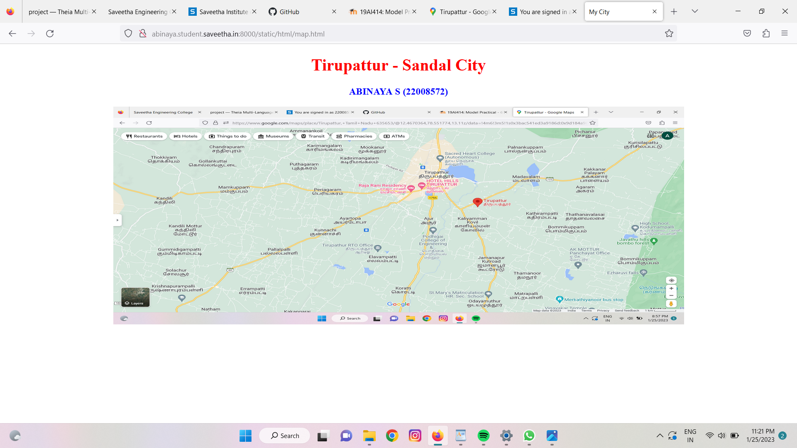
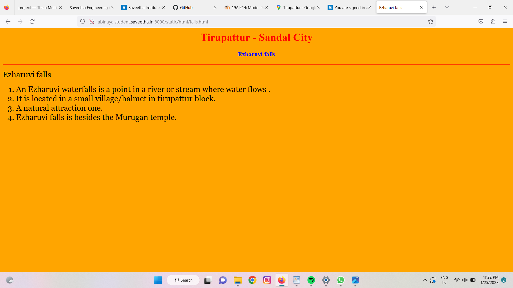
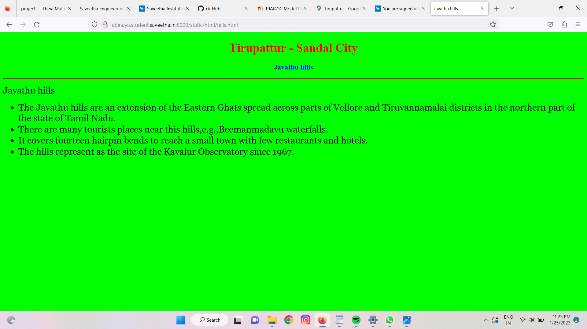
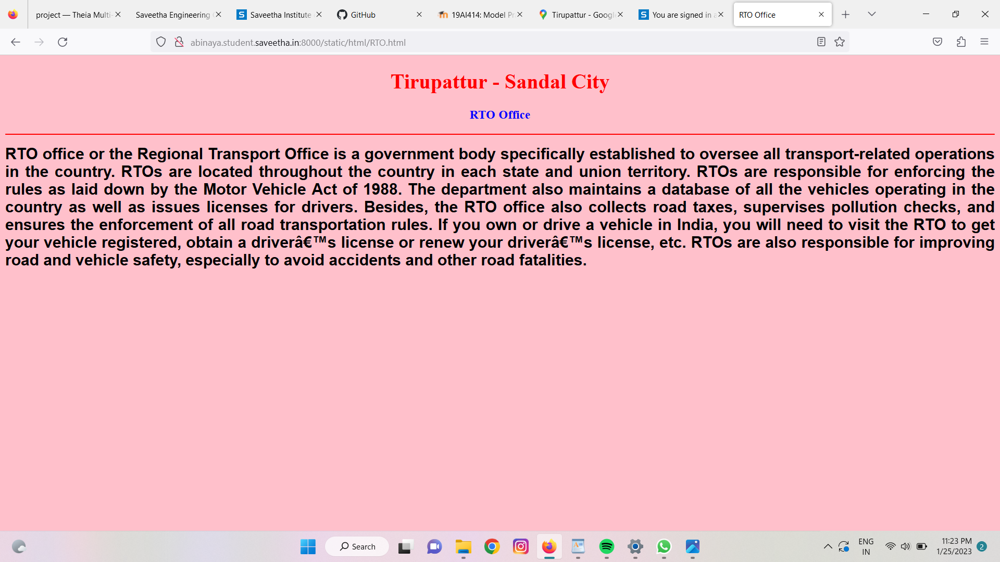
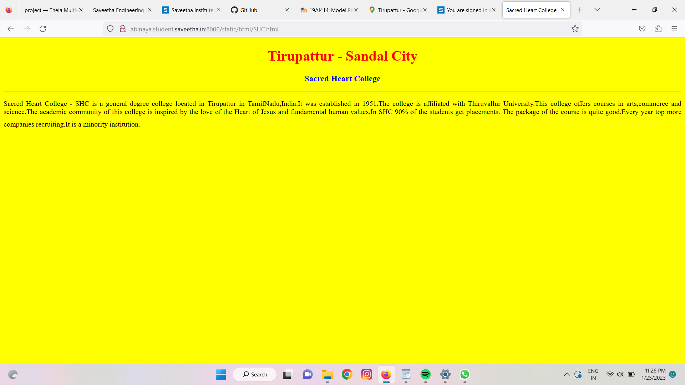
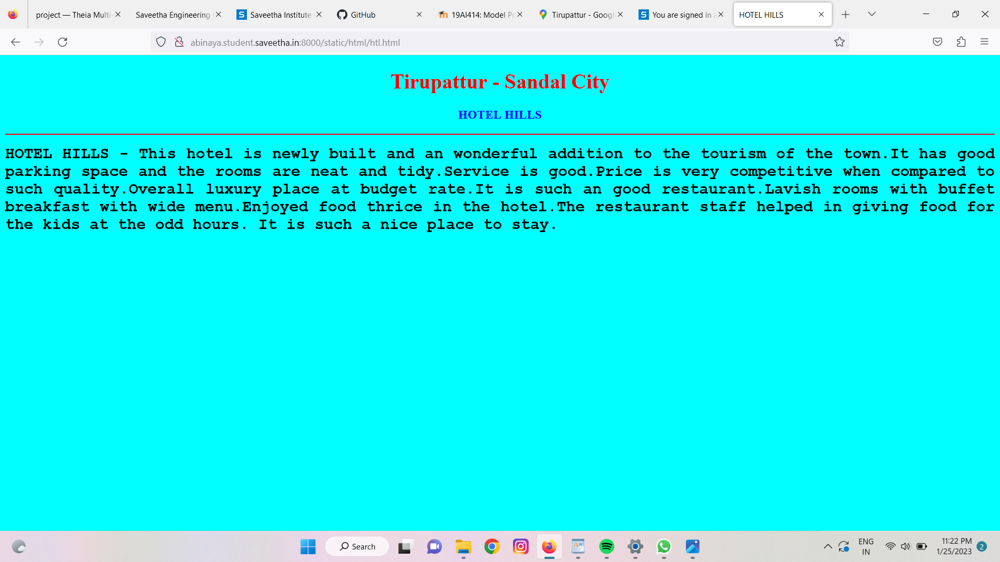
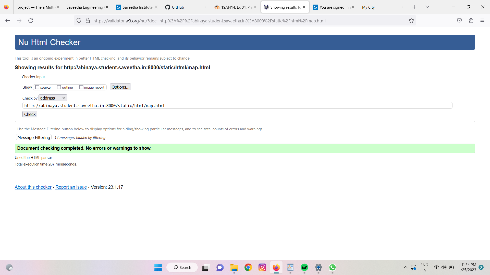

# Places Around Me
## AIM:
To develop a website to display details about the places around my house.

## Design Steps:

### Step 1:
Clone the github repository into Theia IDE.

### Step 2:
Create a new Django project

### Step 3:
Write the needed HTML code.

### Step 4:
Run the Django server and execute the HTML files.

## Code:
```
map.html
<!DOCTYPE html>
<html lang="en">
<head>
<title>My City</title>
</head>
<body>
<h1 align="center">
<font color="red"><b>Tirupattur - Sandal City</b></font>
</h1>
<h3 align="center">
<font color="blue"><b>ABINAYA S (22008572)</b></font>
</h3>
<center>

<map name="MyCity">
<area shape="circle" coords="190,50,20" href="/static/html/htl.html" title="HOTEL HILLS">
<area shape="rectangle" coords="230,30,260,60" href="/static/html/RTO.html" title="RTO Office">
<area shape="circle" coords="400,350,50" href="/static/html/SHC.html" title="Sacred Heart College">
<area shape="circle" coords="400,200,75" href="/static/html/hills.html" title="Javathu hills">
<area shape="rectangle" coords="490,150,870,320" href="/static/html/falls.html" title="Ezharuvi falls">
</map>
</center>
</body>
</html>

SHC.html
<!DOCTYPE html>
<html lang="en">
<head>
<title>Sacred Heart College</title>
</head>
<body bgcolor="yellow">
<h1 align="center">
<font color="red"><b>Tirupattur - Sandal City</b></font>
</h1>
<h3 align="center">
<font color="blue"><b>Sacred Heart College</b></font>
</h3>
<hr size="3" color="red">
<p align="justify">
Sacred Heart College - SHC is a general degree college located in Tirupattur in TamilNadu,India.It was established in 1951.The college is affiliated with Thiruvallur University.This college offers courses in arts,commerce and science.The academic community of this college is inspired by the love of the Heart of Jesus and fundamental human values.In SHC 90% of the students get placements. The package of the course is quite good.Every year top more companies recruiting.It is a minority institution.
<font face="Tahoma" size="5">
</font>
</p>
</body>
</html

hills.html
<!DOCTYPE html>
<html lang="en">
<head>
<title>Javathu hills</title>
</head>
<body bgcolor="lime">
<h1 align="center">
<font color="red"><b>Tirupattur - Sandal City</b></font>
</h1>
<h3 align="center">
<font color="blue"><b>Javathu hills</b></font>
</h3>
<hr size="3" color="red">
<p align="justify">
<font face="Georgia" size="5">
Javathu hills
<ul>
<li>The Javathu hills are an extension of the Eastern Ghats spread across parts of Vellore and Tiruvannamalai districts in the northern part of the state of Tamil Nadu.</li>
<li>There are many tourists places near this hills,e.g.,Beemanmadavu waterfalls.</li>
<li>It covers fourteen hairpin bends to reach a small town with few restaurants and hotels.</li>
<li>The hills represent as the site of the Kavalur Observatory since 1967.</li>
</ul>
</font>
</p>
</body>
</html>

falls.html
<head>
<title>Ezharuvi falls</title>
</head>
<body bgcolor="orange">
<h1 align="center">
<font color="red"><b>Tirupattur - Sandal City</b></font>
</h1>
<h3 align="center">
<font color="blue"><b>Ezharuvi falls</b></font>
</h3>
<hr size="3" color="red">
<p align="justify">
<font face="Georgia" size="5">
Ezharuvi falls
<ol type="1">
<li>An Ezharuvi waterfalls is a point in a river or stream where water flows .</li>
<li>It is located in a small village/halmet in tirupattur block.</li>
<li>A natural attraction one.</li>
<li>Ezharuvi falls is besides the Murugan temple.</li>
</ol>
</font>
</p>
</body>
</html>

RTO.html
<!DOCTYPE html>
<html lang="en">
<head>
<title>RTO Office</title>
</head>
<body bgcolor="pink">
<h1 align="center">
<font color="red"><b></b>Tirupattur - Sandal City</font>
</h1>
<h3 align="center">
<font color="blue"><b>RTO Office</b></font>
</h3>
<hr size="3" color="red">
<p align="justify">
<font face="Arial" size="5">
<b>
RTO office or the Regional Transport Office is a government body specifically established to oversee all transport-related operations in the country. RTOs are located throughout the country in each state and union territory. RTOs are responsible for enforcing the rules as laid down by the Motor Vehicle Act of 1988.
The department also maintains a database of all the vehicles operating in the country as well as issues licenses for drivers. Besides, the RTO office also collects road taxes, supervises pollution checks, and ensures the enforcement of all road transportation rules. If you own or drive a vehicle in India, you will need to visit the RTO to get your vehicle registered, obtain a driver’s license or renew your driver’s license, etc.
RTOs are also responsible for improving road and vehicle safety, especially to avoid accidents and other road fatalities.
</b>
</font>
</p>
</body>
</html>

htl.html
<!DOCTYPE html>
<html lang="en">
<head>
<title>HOTEL HILLS</title>
</head>
<body bgcolor="cyan">
<h1 align="center">
<font color="red"><b>Tirupattur - Sandal City</b></font>
</h1>
<h3 align="center">
<font color="blue"><b>HOTEL HILLS</b></font>
</h3>
<hr size="3" color="red">
<p align="justify">
<font face="Courier New" size="5">
<b>
HOTEL HILLS - This hotel is newly built and an wonderful addition to the tourism of the town.It has good parking space and the rooms are neat and tidy.Service is good.Price is very competitive when compared to such quality.Overall luxury place at budget rate.It is such an good restaurant.Lavish rooms with buffet breakfast with wide menu.Enjoyed food thrice in the hotel.The restaurant staff helped in giving food for the kids at the odd hours. It is such a nice place to stay.
</b>
</font>
</p>
</body>
</html>
```

## Output:












## HTML Validator

## Result:
The program for implementing image map is executed successfully.